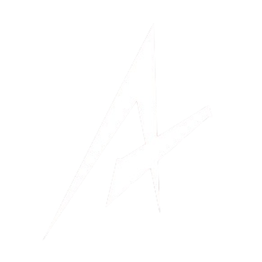

<p align="center">
  
</p>

<h1 align="center">GitHub Projects Showcase</h1>

<p align="center">
  A curated gallery of open-source projects from the community.<br/>
  Discover tools, libraries, and frameworks worth exploring.
</p>

<p align="center">
  
  
  
</p>

---

## Getting Started

```bash
npm install
npm run dev
```

Open [http://localhost:3000](http://localhost:3000).

## Environment Variables

Create a `.env.local` file:

```env
# GitHub API (for project submissions via PR)
GH_TOKEN=your_github_pat          # PAT with repo scope

# Cloudflare Turnstile (optional — skipped if missing)
NEXT_PUBLIC_TURNSTILE_SITE_KEY=
TURNSTILE_SECRET_KEY=

# Upstash Redis rate limiting (optional — skipped if missing)
UPSTASH_REDIS_REST_URL=
UPSTASH_REDIS_REST_TOKEN=
```

All anti-spam variables are optional. The app works without them for local development.

## Project Structure

```
app/
  page.tsx              # Home — featured projects
  projects/page.tsx     # Explore all projects
  actions/              # Server Actions (submit via PR)
components/
  ui/                   # Nav, glow-card, background, animate-in
  projects/             # Grid, card, search, tag filter
  submit/               # Modal + form
data/
  projects.json         # Project data source
lib/
  types.ts              # TypeScript interfaces
  utils.ts              # Utilities (cn)
```

## Deployment

```bash
npm run build
npm start
```

Before deploying:

1. Set all environment variables on your hosting platform
2. Create a `project-submission` label in your GitHub repo
3. Configure Cloudflare Turnstile and Upstash Redis for production

Compatible with Vercel, Netlify, or any Node.js hosting.

## How Submissions Work

Users submit projects through a modal form. Each submission automatically:

1. Creates a new branch with the project added to `projects.json`
2. Opens a **Pull Request** for review
3. Once merged, the project goes live on the next deploy

**Anti-spam:** Cloudflare Turnstile (bot protection) + Upstash Redis (2 submissions/IP/24h).

## License

MIT
